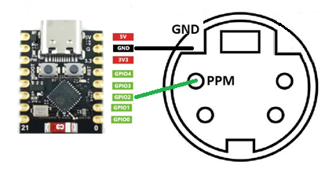
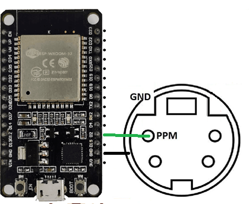

# 🖼️ Galeria do Projeto

Aqui você encontra todos os esquemas e referências visuais para a montagem do seu PPM2BT-Gamepad.

---

### 📍 Esquemas e Pinagem
| Pinout FLYSKY-Trainer+Esp32-C3_super_mini | FLYSKY-Trainer+Esp32-DOITv1 |
| :---: | :---: |
|  |  |

### 📸 Montagem Real
| FS-I6-internal+Esp32-C3_super_mini + Modificação de LED (Remoção) ||
| :---: | :---: |
| |

---
[⬅️ Voltar para o menu principal](../README.md)